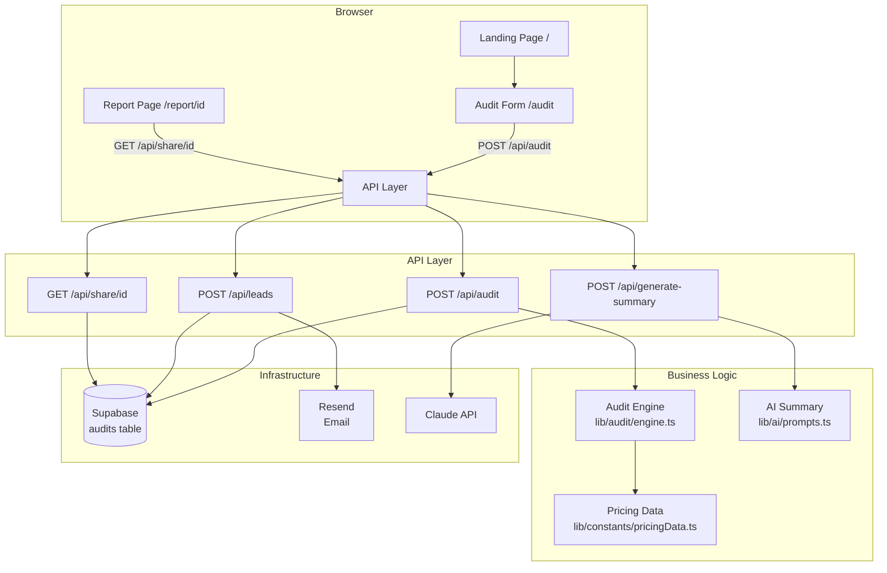
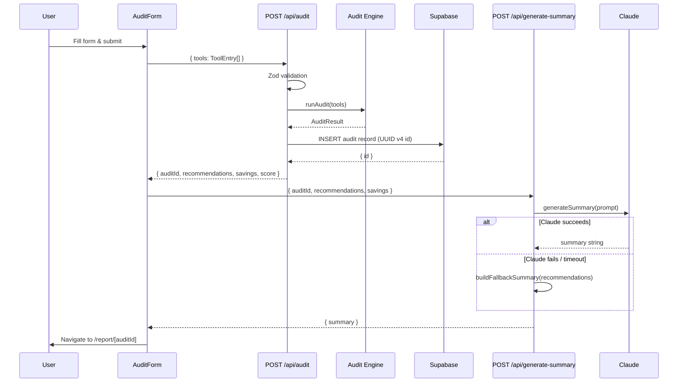
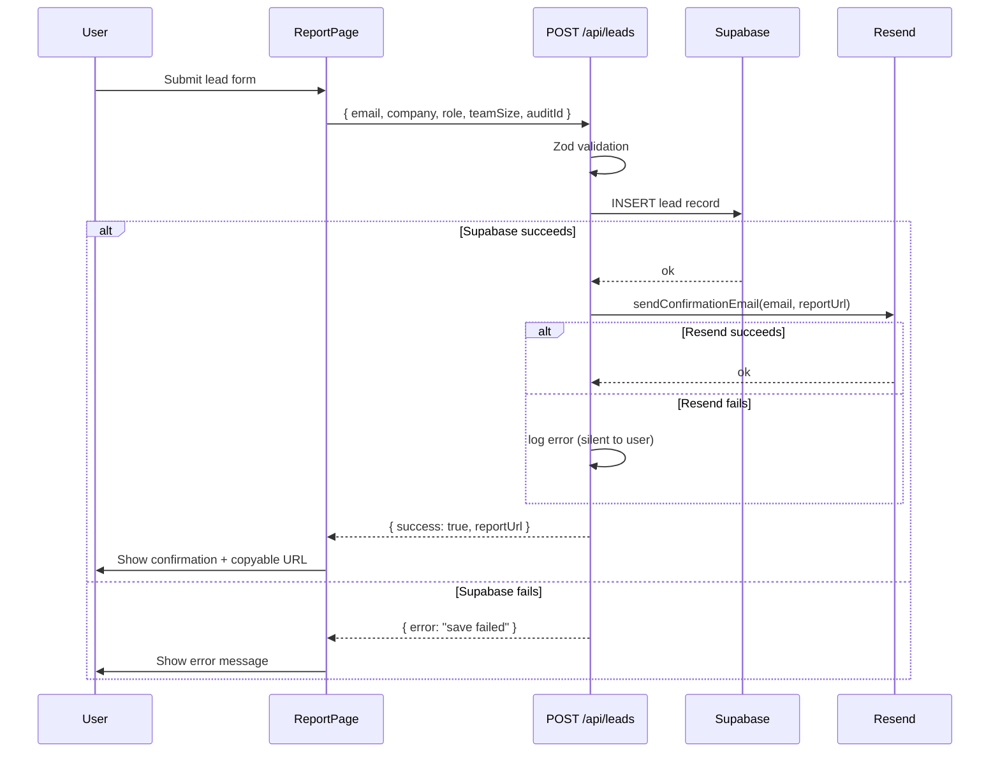

# Design Document: AIStack Auditor

## Overview

AIStack Auditor is a production-quality SaaS MVP built with Next.js 14 (App Router), TypeScript (strict mode), Supabase, Resend, and the Claude API. The platform lets startup founders and team leads input their AI tool subscriptions, runs a deterministic audit engine to surface redundancies and savings opportunities, generates an AI-powered natural-language summary, captures leads, and produces public shareable report URLs — all without authentication.

### Key Design Principles

- **Determinism first**: The audit engine is a pure function with no I/O. Given the same inputs it always produces the same outputs. This makes it trivially testable and reproducible.
- **Centralized pricing**: All monetary values live in one versioned file (`lib/constants/pricingData.ts`). No rule or calculation logic hardcodes a dollar amount.
- **Separation of concerns**: Frontend form → API route → pure engine → persistence → email. Each layer has a single responsibility.
- **Frictionless UX**: No authentication. The audit form persists to localStorage. Reports are publicly accessible by URL.
- **Graceful degradation**: Claude API failures fall back to a deterministic summary. Resend failures are logged but not surfaced to the user.

### Technology Stack

| Layer | Technology |
|---|---|
| Framework | Next.js 14 (App Router, TypeScript strict) |
| Styling | Tailwind CSS |
| Forms | React Hook Form + Zod resolvers |
| Database | Supabase (hosted Postgres) |
| Email | Resend |
| AI | Anthropic Claude API (`@anthropic-ai/sdk`) |
| Testing | Vitest |
| Deployment | Vercel |

---

## Architecture

The system follows a layered architecture with clear boundaries between the UI, API, business logic, and infrastructure layers.



### Request Flow: Audit Submission



### Request Flow: Lead Capture



---

## Components and Interfaces

### Folder Structure

```
app/
  page.tsx                    # Landing page (/)
  audit/
    page.tsx                  # Audit form page (/audit)
  report/
    [id]/
      page.tsx                # Shareable report page (/report/[id])
  api/
    audit/
      route.ts                # POST /api/audit
    generate-summary/
      route.ts                # POST /api/generate-summary
    leads/
      route.ts                # POST /api/leads
    share/
      [id]/
        route.ts              # GET /api/share/[id]

components/
  audit/
    AuditForm.tsx             # Multi-row tool entry form
    ToolRow.tsx               # Single tool entry row
    ToolRowSkeleton.tsx       # Loading skeleton for tool row
  report/
    ReportHeader.tsx          # Score + savings summary
    RecommendationCard.tsx    # Individual recommendation card
    AiInsightsCard.tsx        # AI summary card
    LeadCaptureForm.tsx       # Lead capture form
    LeadConfirmation.tsx      # Post-submission confirmation
    ScoreBadge.tsx            # Color-coded optimization score
  landing/
    Hero.tsx
    Features.tsx
    HowItWorks.tsx
    Faq.tsx
    Cta.tsx
    Footer.tsx
  ui/
    Button.tsx
    Input.tsx
    Select.tsx
    Badge.tsx
    Card.tsx
    Spinner.tsx

lib/
  audit/
    engine.ts                 # Pure audit function
    rules.ts                  # Individual rule implementations
    calculations.ts           # Savings & score calculations
  ai/
    prompts.ts                # Prompt construction + fallback
    client.ts                 # Anthropic SDK wrapper
  constants/
    pricingData.ts            # Versioned pricing constants
  supabase/
    client.ts                 # Supabase browser client
    server.ts                 # Supabase server client
  resend/
    client.ts                 # Resend client wrapper
    templates.ts              # Email HTML templates
  schemas/
    auditSchema.ts            # Zod schema for audit input
    leadSchema.ts             # Zod schema for lead input
    summarySchema.ts          # Zod schema for summary request
  utils/
    currency.ts               # USD formatting helpers
    uuid.ts                   # UUID v4 generation

hooks/
  useAuditForm.ts             # Form state + localStorage persistence
  useLocalStorage.ts          # Generic localStorage hook

tests/
  audit/
    engine.test.ts
    calculations.test.ts
    rules.test.ts
  pricing/
    pricingData.test.ts

types/
  audit.ts
  tool.ts
  recommendation.ts
  api.ts

public/
  og-default.png
```

### Component Interfaces

#### AuditForm

```typescript
// No external props — manages its own state via useAuditForm hook
interface AuditFormProps {
  // intentionally empty; form is self-contained
}
```

#### ToolRow

```typescript
interface ToolRowProps {
  index: number;
  control: Control<AuditFormValues>;
  onRemove: (index: number) => void;
  isRemoveDisabled: boolean;
}
```

#### RecommendationCard

```typescript
interface RecommendationCardProps {
  recommendation: Recommendation;
}
```

#### AiInsightsCard

```typescript
interface AiInsightsCardProps {
  summary: string | null;
  error: string | null;
  isLoading: boolean;
}
```

#### LeadCaptureForm

```typescript
interface LeadCaptureFormProps {
  auditId: string;
  onSuccess: (reportUrl: string) => void;
}
```

#### ScoreBadge

```typescript
interface ScoreBadgeProps {
  score: number; // 0–100
}
```

#### ReportHeader

```typescript
interface ReportHeaderProps {
  score: number;
  totalMonthlySavings: number;
  totalYearlySavings: number;
}
```

---

## Data Models

### Domain Types (`types/`)

#### `types/tool.ts`

```typescript
export type ToolName =
  | "ChatGPT"
  | "Claude"
  | "Cursor"
  | "GitHub Copilot"
  | "Gemini"
  | "Windsurf";

export type PlanName =
  | "Free"
  | "Plus"
  | "Pro"
  | "Team"
  | "Teams"
  | "Business"
  | "Individual"
  | "Enterprise";

export interface ToolEntry {
  tool: ToolName;
  plan: PlanName;
  seats: number;          // 1–10,000
  monthlySpend: number;   // USD, ≥ 0, ≤ 1,000,000
  useCase?: string;       // max 500 chars
}

export interface PricingPlan {
  name: PlanName;
  pricePerSeat: number;   // USD per seat per month
}

export interface ToolPricing {
  tool: ToolName;
  plans: PricingPlan[];
}
```

#### `types/recommendation.ts`

```typescript
export type RecommendationType = "downgrade" | "free-tier" | "overlap";

export interface Recommendation {
  id: string;                       // deterministic: `${ruleId}-${toolName}`
  type: RecommendationType;
  toolName: ToolName;
  currentPlan: PlanName;
  recommendedPlan: PlanName | null; // null for overlap removals
  currentPricePerSeat: number;
  recommendedPricePerSeat: number | null;
  monthlySavings: number;           // USD, rounded to 2dp
  yearlySavings: number;            // monthlySavings * 12
  explanation: string;
  isOverlap: boolean;
  overlappingTools?: ToolName[];    // populated for overlap recommendations
}
```

#### `types/audit.ts`

```typescript
import type { ToolEntry } from "./tool";
import type { Recommendation } from "./recommendation";

export interface AuditInput {
  tools: ToolEntry[];
}

export interface AuditResult {
  recommendations: Recommendation[];
  totalMonthlySavings: number;
  totalYearlySavings: number;
  optimizationScore: number;        // 0–100
  engineVersion: string;            // matches PRICING_DATA_VERSION
}

export interface AuditError {
  code: "INVALID_INPUT" | "TOO_MANY_ENTRIES" | "MISSING_PRICING" | "ENGINE_ERROR";
  message: string;
  invalidEntryIndex?: number;
}

export type AuditEngineOutput = AuditResult | AuditError;

export interface StoredAudit {
  id: string;                       // UUID v4
  input: AuditInput;
  result: AuditResult;
  aiSummary: string | null;
  createdAt: string;                // ISO 8601
}
```

#### `types/api.ts`

```typescript
import type { AuditResult, StoredAudit } from "./audit";
import type { Recommendation } from "./recommendation";

// POST /api/audit
export interface AuditRequestBody {
  tools: ToolEntry[];
}
export interface AuditResponseBody {
  auditId: string;
  recommendations: Recommendation[];
  totalMonthlySavings: number;
  totalYearlySavings: number;
  optimizationScore: number;
}

// POST /api/generate-summary
export interface SummaryRequestBody {
  auditId: string;
  recommendations: Recommendation[];
  totalMonthlySavings: number;
  totalYearlySavings: number;
}
export interface SummaryResponseBody {
  summary: string;
}

// POST /api/leads
export interface LeadRequestBody {
  email: string;
  company: string;
  role: string;
  teamSize: number;
  auditId: string;
}
export interface LeadResponseBody {
  success: boolean;
  reportUrl: string;
}

// GET /api/share/[id]
export interface ShareResponseBody {
  audit: StoredAudit;
}

// Generic error response
export interface ApiErrorResponse {
  message: string;
  errors?: Array<{ field: string; message: string }>;
}
```

### Supabase Schema

#### `audits` table

```sql
CREATE TABLE audits (
  id          UUID PRIMARY KEY DEFAULT gen_random_uuid(),
  input       JSONB NOT NULL,
  result      JSONB NOT NULL,
  ai_summary  TEXT,
  created_at  TIMESTAMPTZ NOT NULL DEFAULT now()
);
```

#### `leads` table

```sql
CREATE TABLE leads (
  id          UUID PRIMARY KEY DEFAULT gen_random_uuid(),
  audit_id    UUID REFERENCES audits(id),
  email       TEXT NOT NULL,
  company     TEXT NOT NULL,
  role        TEXT NOT NULL,
  team_size   INTEGER NOT NULL CHECK (team_size >= 1 AND team_size <= 10000),
  created_at  TIMESTAMPTZ NOT NULL DEFAULT now()
);

CREATE INDEX leads_audit_id_idx ON leads(audit_id);
CREATE INDEX leads_email_idx ON leads(email);
```

### Pricing Data Structure (`lib/constants/pricingData.ts`)

```typescript
export const PRICING_DATA_VERSION = "1.0.0";

export const PRICING_DATA: ToolPricing[] = [
  {
    tool: "ChatGPT",
    plans: [
      { name: "Free",       pricePerSeat: 0   },
      { name: "Plus",       pricePerSeat: 20  },
      { name: "Team",       pricePerSeat: 25  },
      { name: "Enterprise", pricePerSeat: 60  },
    ],
  },
  {
    tool: "Claude",
    plans: [
      { name: "Free",       pricePerSeat: 0   },
      { name: "Pro",        pricePerSeat: 20  },
      { name: "Team",       pricePerSeat: 25  },
      { name: "Enterprise", pricePerSeat: 60  },
    ],
  },
  {
    tool: "Cursor",
    plans: [
      { name: "Free",       pricePerSeat: 0   },
      { name: "Pro",        pricePerSeat: 20  },
      { name: "Business",   pricePerSeat: 40  },
    ],
  },
  {
    tool: "GitHub Copilot",
    plans: [
      { name: "Free",       pricePerSeat: 0   },
      { name: "Individual", pricePerSeat: 10  },
      { name: "Business",   pricePerSeat: 19  },
      { name: "Enterprise", pricePerSeat: 39  },
    ],
  },
  {
    tool: "Gemini",
    plans: [
      { name: "Free",       pricePerSeat: 0   },
      { name: "Business",   pricePerSeat: 20  },
      { name: "Enterprise", pricePerSeat: 30  },
    ],
  },
  {
    tool: "Windsurf",
    plans: [
      { name: "Free",       pricePerSeat: 0   },
      { name: "Pro",        pricePerSeat: 15  },
      { name: "Teams",      pricePerSeat: 35  },
    ],
  },
];
```

### Zod Schemas

#### `lib/schemas/auditSchema.ts`

```typescript
import { z } from "zod";

export const toolEntrySchema = z.object({
  tool: z.enum(["ChatGPT", "Claude", "Cursor", "GitHub Copilot", "Gemini", "Windsurf"]),
  plan: z.enum(["Free", "Plus", "Pro", "Team", "Teams", "Business", "Individual", "Enterprise"]),
  seats: z.number().int().min(1).max(10000),
  monthlySpend: z.number().min(0).max(1000000),
  useCase: z.string().max(500).optional(),
});

export const auditRequestSchema = z.object({
  tools: z.array(toolEntrySchema).min(1).max(10),
});
```

#### `lib/schemas/leadSchema.ts`

```typescript
import { z } from "zod";

export const leadSchema = z.object({
  email: z.string().email(),
  company: z.string().min(1),
  role: z.string().min(1),
  teamSize: z.number().int().min(1).max(10000),
  auditId: z.string().uuid(),
});
```

---

## Correctness Properties

*A property is a characteristic or behavior that should hold true across all valid executions of a system — essentially, a formal statement about what the system should do. Properties serve as the bridge between human-readable specifications and machine-verifiable correctness guarantees.*


### Property 1: Audit Engine Determinism

*For any* valid array of tool entries (1–10 items), calling the Audit Engine twice with the same input must produce results that are deeply equal — identical recommendations in the same order with the same savings figures and the same optimization score.

**Validates: Requirements 2.8**

---

### Property 2: ChatGPT Team Downgrade Savings Formula

*For any* seat count `n` in [1, 2], submitting a ChatGPT Team entry with `n` seats must produce a downgrade recommendation whose `monthlySavings` equals `(PRICING_DATA["ChatGPT"]["Team"].pricePerSeat − PRICING_DATA["ChatGPT"]["Plus"].pricePerSeat) × n` (i.e., `5 × n`), and whose `yearlySavings` equals `monthlySavings × 12`.

**Validates: Requirements 2.2, 3.1, 3.2**

---

### Property 3: Enterprise Downgrade Rule

*For any* tool that has an Enterprise plan in Pricing_Data, and *for any* seat count in [1, 4], submitting that tool on the Enterprise plan must produce a downgrade recommendation to the next lower plan tier with `monthlySavings = (enterprisePrice − nextLowerPrice) × seats`.

**Validates: Requirements 2.3, 3.1**

---

### Property 4: LLM Overlap Detection

*For any* valid tool stack that includes ChatGPT, Claude, and Gemini (with any plans, seat counts, and spend values), the Audit Engine must produce exactly one overlap recommendation whose `overlappingTools` array contains all three tool names.

**Validates: Requirements 2.4**

---

### Property 5: IDE Tool Overlap Retention Rule

*For any* pair of IDE tools (Cursor + GitHub Copilot, or Cursor + Windsurf) present in a stack with unequal seat counts, the overlap recommendation must identify the tool with the higher seat count as the one to retain. When seat counts are equal, either tool may be recommended for retention.

**Validates: Requirements 2.5, 2.6**

---

### Property 6: Free-Tier Recommendation

*For any* tool that has a Free plan in Pricing_Data, and *for any* paid plan entry with exactly 1 seat, the Audit Engine must produce a free-tier recommendation whose `monthlySavings` equals the user's submitted `monthlySpend` for that entry.

**Validates: Requirements 2.7**

---

### Property 7: Invalid Input Returns Error

*For any* tool entry array containing at least one entry with a missing or invalid required field (tool name, plan, seats, or monthly spend), the Audit Engine must return an `AuditError` with `code: "INVALID_INPUT"` rather than a partial `AuditResult`.

**Validates: Requirements 2.11**

---

### Property 8: Oversized Input Returns Error

*For any* array of 11 or more tool entries, the Audit Engine must return an `AuditError` with `code: "TOO_MANY_ENTRIES"` without producing any recommendations.

**Validates: Requirements 2.12**

---

### Property 9: Savings Aggregation Invariant

*For any* audit result, `totalMonthlySavings` must equal the sum of `monthlySavings` across all recommendations, and `totalYearlySavings` must equal the sum of `yearlySavings` across all recommendations.

**Validates: Requirements 3.3, 3.4**

---

### Property 10: Monetary Value Invariants

*For any* recommendation in any audit result: (a) `yearlySavings` must equal `monthlySavings × 12`; (b) both `monthlySavings` and `yearlySavings` must have at most two decimal places; (c) `monthlySavings` must be strictly greater than zero (zero or negative savings are filtered out).

**Validates: Requirements 3.2, 3.6, 3.7**

---

### Property 11: Optimization Score Formula and Range

*For any* valid tool entry array where `totalCurrentSpend > 0`, the `optimizationScore` must equal `clamp(round((1 − totalMonthlySavings / totalCurrentSpend) × 100), 0, 100)` and must be an integer. When `totalCurrentSpend = 0`, the score must be exactly 100.

**Validates: Requirements 4.1, 4.2, 4.3**

---

### Property 12: Lead Zod Schema Rejects Invalid Inputs

*For any* lead object with at least one invalid field (malformed email, empty company/role, team size outside [1, 10000], or non-UUID auditId), the lead Zod schema must return a validation error. *For any* lead object where all fields are valid, the schema must parse successfully without errors.

**Validates: Requirements 7.8**

---

### Property 13: UUID Uniqueness

*For any* two separate audit submissions, the generated audit IDs must be different strings and must each match the UUID v4 format (`/^[0-9a-f]{8}-[0-9a-f]{4}-4[0-9a-f]{3}-[89ab][0-9a-f]{3}-[0-9a-f]{12}$/i`).

**Validates: Requirements 8.1, 8.6**

---

## Error Handling

### Audit Engine Errors

The engine returns a typed `AuditError` union member rather than throwing. Callers must discriminate on the `code` field:

| Code | Trigger | HTTP Status |
|---|---|---|
| `INVALID_INPUT` | Missing/invalid required field in a tool entry | 400 |
| `TOO_MANY_ENTRIES` | Input array length > 10 | 400 |
| `MISSING_PRICING` | Engine references a Tool/Plan not in Pricing_Data | 500 |
| `ENGINE_ERROR` | Unexpected runtime error in engine logic | 500 |

### API Route Error Handling

All API routes follow a consistent error response shape:

```typescript
// 400 — validation failure
{ "errors": [{ "field": "tools[0].seats", "message": "Number must be at least 1" }] }

// 500 — unexpected server error
{ "message": "Internal server error" }

// 503 — Supabase persistence failure on POST /api/audit
{ "message": "Audit could not be saved. Please try again." }
```

Routes log all 5xx errors server-side using `console.error` (or a structured logger) before responding.

### Claude API Fallback

```typescript
// lib/ai/prompts.ts
export function buildFallbackSummary(result: AuditResult): string {
  const count = result.recommendations.length;
  const savings = formatUSD(result.totalMonthlySavings);
  if (count === 0) {
    return `Your AI stack is well-optimized with a score of ${result.optimizationScore}/100. No redundancies or savings opportunities were identified.`;
  }
  return `We identified ${count} optimization ${count === 1 ? "opportunity" : "opportunities"} in your AI stack, with potential savings of ${savings}/month ($${formatUSD(result.totalYearlySavings)}/year). Your current optimization score is ${result.optimizationScore}/100.`;
}
```

The fallback is invoked when:
1. The Claude API returns a non-2xx response
2. The Claude API call times out after 10 seconds
3. The Claude SDK throws an unexpected error

If the fallback itself throws (e.g., due to a malformed `AuditResult`), the `POST /api/generate-summary` route returns a 500 with `{ message: "Summary generation failed" }`.

### Resend Email Failure

Email delivery failure is intentionally silent to the user. The lead record is already persisted in Supabase, so the user's data is safe. The server logs the Resend error with the lead ID for manual follow-up.

### localStorage Corruption

The `useAuditForm` hook wraps the localStorage read in a try/catch and validates the parsed value against the `auditRequestSchema`. If parsing or validation fails, the hook discards the stored value and initializes with a single empty tool row.

### 404 Handling for Report Pages

The `/report/[id]` page uses Next.js `notFound()` when:
- The Supabase query returns no rows for the given ID
- The Supabase query throws (network error, timeout)
- The returned row fails to parse as a `StoredAudit`

---

## Testing Strategy

### Overview

The test suite uses **Vitest** with TypeScript. Tests are co-located under `tests/` and mirror the `lib/` structure. The strategy combines:

- **Property-based tests** (via `fast-check`) for the audit engine, calculations, and schema validation — verifying universal invariants across hundreds of generated inputs
- **Example-based unit tests** for specific required scenarios (ChatGPT Team 2-seat rule, overlap detection, score formula)
- **Integration tests** for Supabase and Resend interactions (using mocks/stubs)

### Property-Based Testing

The feature is well-suited for property-based testing because:
- The audit engine is a pure function with a large, structured input space
- Savings calculations follow deterministic formulas that must hold for all valid inputs
- Zod schema validation has clear accept/reject boundaries across all possible inputs

**Library**: [`fast-check`](https://fast-check.dev/) — a mature TypeScript-first PBT library.

**Configuration**: Each property test runs a minimum of **100 iterations** (`{ numRuns: 100 }`).

**Tag format**: Each property test is annotated with a comment:
```
// Feature: aistack-auditor, Property N: <property_text>
```

#### Arbitraries (Generators)

```typescript
// tests/arbitraries.ts
import * as fc from "fast-check";
import type { ToolEntry } from "../types/tool";

export const toolNameArb = fc.constantFrom(
  "ChatGPT", "Claude", "Cursor", "GitHub Copilot", "Gemini", "Windsurf"
);

export const planNameArb = fc.constantFrom(
  "Free", "Plus", "Pro", "Team", "Teams", "Business", "Individual", "Enterprise"
);

export const toolEntryArb: fc.Arbitrary<ToolEntry> = fc.record({
  tool: toolNameArb,
  plan: planNameArb,
  seats: fc.integer({ min: 1, max: 10000 }),
  monthlySpend: fc.float({ min: 0, max: 1000000, noNaN: true }),
  useCase: fc.option(fc.string({ maxLength: 500 }), { nil: undefined }),
});

export const validToolArrayArb = fc.array(toolEntryArb, { minLength: 1, maxLength: 10 });
```

### Test File Structure

```
tests/
  audit/
    engine.test.ts          # Properties 1, 7, 8 + required examples
    calculations.test.ts    # Properties 9, 10, 11 + required examples
    rules.test.ts           # Properties 2, 3, 4, 5, 6
  pricing/
    pricingData.test.ts     # Pricing completeness + version format
  schemas/
    leadSchema.test.ts      # Property 12
  utils/
    uuid.test.ts            # Property 13
  arbitraries.ts            # Shared fast-check arbitraries
```

### Required Example Tests (from Requirements 12)

These specific scenarios are mandated by the requirements and must be implemented as example-based tests:

```typescript
// tests/audit/engine.test.ts

// Req 12.2
it("ChatGPT Team 2 seats → $10.00/mo, $120.00/yr savings", () => {
  const result = runAudit([{ tool: "ChatGPT", plan: "Team", seats: 2, monthlySpend: 50 }]);
  expect(result.recommendations[0].monthlySavings).toBe(10.00);
  expect(result.recommendations[0].yearlySavings).toBe(120.00);
});

// Req 12.3
it("ChatGPT + Claude + Gemini → overlap recommendation naming all three", () => {
  const result = runAudit([
    { tool: "ChatGPT", plan: "Plus", seats: 1, monthlySpend: 20 },
    { tool: "Claude",  plan: "Pro",  seats: 1, monthlySpend: 20 },
    { tool: "Gemini",  plan: "Business", seats: 1, monthlySpend: 20 },
  ]);
  const overlap = result.recommendations.find(r => r.isOverlap);
  expect(overlap?.overlappingTools).toContain("ChatGPT");
  expect(overlap?.overlappingTools).toContain("Claude");
  expect(overlap?.overlappingTools).toContain("Gemini");
});

// Req 12.4
it("score = 75 for $100 spend / $25 savings; score = 100 for $0 spend", () => {
  // tested via calculations module directly
  expect(computeScore(100, 25)).toBe(75);
  expect(computeScore(0, 0)).toBe(100);
});

// Req 12.5
it("no matching rules → empty recommendations array", () => {
  const result = runAudit([{ tool: "GitHub Copilot", plan: "Individual", seats: 5, monthlySpend: 50 }]);
  expect(result.recommendations).toHaveLength(0);
});

// Req 12.6
it("all monetary values are rounded to 2 decimal places", () => {
  // covered by Property 10 property test; also verified with a concrete example
});
```

### Unit Testing Balance

Unit tests focus on:
- The specific required scenarios above
- Edge cases: zero spend, single-seat free-tier, equal seat counts in overlap rules
- Error paths: invalid input, too many entries, missing pricing data

Property tests handle the broad input space, so unit tests are kept minimal and targeted.

### Integration Tests

Integration tests for Supabase and Resend use mocked clients (via `vi.mock`) to avoid real network calls in CI:

```typescript
// tests/api/leads.test.ts
vi.mock("../../lib/supabase/server");
vi.mock("../../lib/resend/client");

it("stores lead and triggers email on valid input", async () => { ... });
it("returns 400 on invalid email", async () => { ... });
it("returns error and skips email if Supabase write fails", async () => { ... });
it("logs Resend error silently if email fails", async () => { ... });
```

### Running Tests

```bash
# Single run (CI / requirements compliance)
vitest --run

# Watch mode (development)
vitest
```

All tests must pass with zero failures when run via `vitest --run`.
